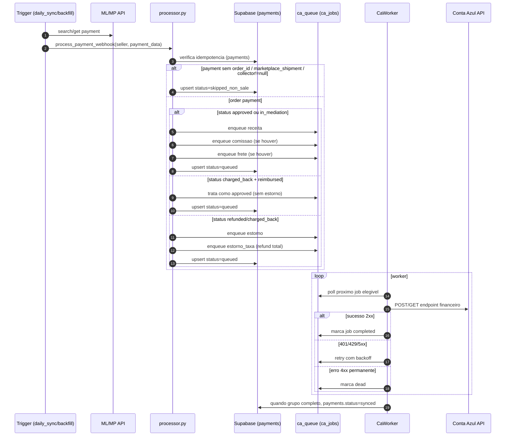
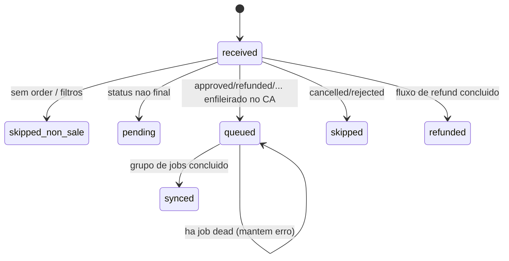

# Diagrama Fluxo Completo da API V2

## 1) Mapa geral (entrada, processamento, fila, baixa, legado)

```mermaid
flowchart TD
    ML[Mercado Livre / Mercado Pago] -->|webhook| WH[/POST /webhooks/ml/]
    WH --> WHE[(webhook_events)]
    WH -.payment webhook nao processa venda.- DS

    OP[Operador/Admin] --> BF[/GET /backfill/{seller}/]
    OP --> BX[/GET /baixas/processar/{seller}/]
    OP --> EXPLEG[/POST /expenses/{seller}/legacy-export/]
    OP --> EXPEXP[/GET /expenses/{seller}/export/]
    OP --> QAPI[/GET/POST /queue/*/]
    OP --> ADMSYNC[/POST /admin/sync/trigger/]
    OP --> ADMLEG[/POST /admin/legacy/daily/trigger/]
    OP --> ADMCLOSE[/POST /admin/closing/trigger/]

    subgraph Schedulers[Lifespan schedulers]
        DSCH[daily_sync 00:01]
        BSCH[daily_baixa 10:00]
        LSCH[legacy_daily_export\n(flag legacy_daily_enabled)]
        CSCH[financial_closing 11:30]
        NSCH[nightly_pipeline\n(flag nightly_pipeline_enabled)]
    end

    ADMSYNC --> DS
    BF --> DS
    DSCH --> DS[sync_seller_payments]
    DS --> MLS[/ML API /v1/payments/search\n(date_approved + date_last_updated)/]

    DS --> ORDERQ{payment tem order_id?}
    ORDERQ -->|sim| PROC[processor.process_payment_webhook]
    ORDERQ -->|nao + mode=classifier| NCLS[classify_non_order_payment]
    ORDERQ -->|nao + mode=legacy| NLEG[deferir non-order para legado]

    NCLS --> MPE[(mp_expenses)]
    EXPEXP --> MPE
    EXPEXP --> BATCH[(expense_batches + expense_batch_items)]

    PROC --> PAY[(payments)]
    PROC --> ENQ[ca_queue.enqueue_*]
    ENQ --> JOBS[(ca_jobs)]

    JOBS --> CW[CaWorker]
    CW --> RL[rate_limiter]
    RL --> CA[Conta Azul API]
    CA --> CW
    CW --> JOBS
    CW --> PAY

    BSCH --> BXAUTO[processar_baixas_auto]
    BX --> BXAUTO
    BXAUTO --> RC[release_checker\n(money_release_status)]
    RC --> PAY
    BXAUTO --> ENQB[ca_queue.enqueue_baixa]
    ENQB --> JOBS

    LSCH --> LREP[release_report / settlement report]
    ADMLEG --> LREP
    LREP --> LBR[legacy_bridge + legacy_engine]
    EXPLEG --> LBR
    LBR --> LZIP[ZIP legado\nPAGAMENTO_CONTAS + TRANSFERENCIAS]
    LZIP --> UPL[upload HTTP/GDrive opcional]

    CSCH --> FC[financial_closing]
    ADMCLOSE --> FC
    FC --> PAY
    FC --> MPE
    FC --> BATCH
    FC --> SYNC[(sync_state)]

    NSCH --> DS
    NSCH --> BXAUTO
    NSCH --> LREP
    NSCH --> FC
```

## 2) Fluxo de venda (order payment) ate lancamento no Conta Azul



## 3) Fluxo de caixa diario (criterio de conciliacao)

```mermaid
flowchart LR
    EXT[account_statement\nrelease_report/bank_report] --> SPLIT{classificacao diaria}

    SPLIT --> APIB[Baixa API do dia\nsum(net_amount)\npayments liquidados\nmoney_release_date = dia]
    SPLIT --> LEG[Ajustes legado do dia\nrefund + mediation + reserve\nshipping + payout + non-sale]

    APIB --> MODEL[Modelo do dia]
    LEG --> MODEL
    MODEL --> EQ{extrato_total_dia\n== APIB + LEG ?}
    EQ -->|sim| OK[Fechamento diario OK]
    EQ -->|nao| GAP[Investigar divergencia]
```

## 4) Estados praticos do payment (resumo)


